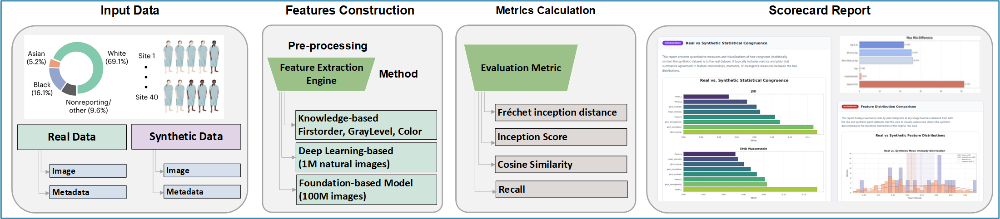

<p align="center">
 <h1 align="center">Synthetic Data ScoreCard: A Data Quality Evaluation Toolbox for Synthetic Medical Data</h1>
</p>

<p align="center">
 
</p>

## Overview

**`Synthetic Data ScoreCard`** is an open-source Python toolbox that implements the **7 Cs evaluation framework** for assessing the quality of Synthetic Medical Data as described in [Zamzmi et al. (2025)].

Synthetic medical data holds significant promise for advancing AI development in healthcare — particularly for addressing data scarcity, privacy constraints, and underrepresentation of rare diseases and populations. However, the quality of synthetic data is critical: poor-quality synthetic data can introduce biases, violate clinical constraints, and ultimately compromise the safety and effectiveness of AI models trained or tested on such data.

This toolbox provides a **quantitative and reproducible** approach to evaluating Synthetic Medical Data across seven clinically relevant criteria (the **7 Cs**), and supports the generation of a structured **Scorecard** to accompany synthetic datasets.

For more information, and technical questions please contact: **[Seyed.Kahaki@fda.hhs.gov](mailto:Seyed.Kahaki@fda.hhs.gov), [Alexander.Webber@fda.hhs.gov](mailto:Alexander.Webber@fda.hhs.gov), or [Tahsin.Rahman@fda.hhs.gov](mailto:Tahsin.Rahman@fda.hhs.gov)**

---

## The 7 Cs Framework

The SMD ScoreCard evaluates synthetic medical data across the following seven dimensions:

1. [**Congruence**](https://github.com/DIDSR/ScoreCard/blob/main/notebooks/01_Congruence.ipynb) — Measures the degree to which the distribution of synthetic data aligns with the distribution of real patient data (e.g., using Fréchet Inception Distance, Cosine Similarity, Jensen-Shannon Divergence).

2. [**Coverage**](https://github.com/DIDSR/ScoreCard/blob/main/notebooks/02_Coverage.ipynb) — Evaluates the extent to which SMD captures the variability, range, and novelty inherent in patient data (e.g., using Convex Hull Volume, Recall, Vendi Score, Entropy).

3. [**Completeness**](https://github.com/DIDSR/ScoreCard/blob/main/notebooks/03_Completeness.ipynb) — Evaluates whether the generated data contains all necessary details relevant to the intended task (e.g., using Proportion of Required Fields, Missing Data Percentage).

4. [**Consistency**](https://github.com/DIDSR/ScoreCard/blob/main/notebooks/04_Consistency.ipynb) — Assesses the stability of SMD quality metrics across demographic subgroups, disease classes, or over time (e.g., using Variance, ANOVA, Maximum-Minimum Difference).

5. **Comprehension** — Evaluates the transparency and clarity of the data generation process and accompanying documentation (e.g., using Documentation Clarity Score).

6. **Constraint** — Assesses adherence to known anatomical, biological, clinical, geometric, or user-defined constraints (e.g., using Constraint Violation Rate, Distance to Constraint Boundary).
   
7. **Compliance** — Reports adherence to privacy standards, format guidelines (e.g., DICOM), and relevant local and international requirements (e.g., using Differential Privacy Score, K-Anonymity Level, Re-identification Risk metrics).


---

## Synthetic Medical Data Scorecard Structure

In addition to quantitative evaluation, this toolbox supports generation of a structured **SMD Scorecard** report containing the following sections:

1. **General Information** — Dataset name, modality, size, labels, licensing, and point of contact.
2. **Data Quality Evaluation (7 Cs)** — Quantitative results for each of the seven criteria.
3. **Task-based Evaluation** — Performance metrics for specific downstream tasks.
4. **Human-based Evaluation** — Results from qualitative reader studies and failure case analysis.
5. **Ethical Considerations, Limitations & Recommendations** — Known biases, limitations, and best practices.
6. **Dataset Usage** — Repository links, preprocessing requirements, and user documentation.
7. **Training & Validation Process** — Description of the synthetic data generation pipeline.
8. **Reference Dataset Information** — Key details of the patient dataset used for comparison.

---

## Getting Started

### Installation & Startup

- Clone this repository and navigate to the project directory

- Ensure you are using ``` Python 3.12 ```
- Install requirements: ``` pip install -r requirements.txt ```
- Use the IPython notebooks in `notebooks` to visualize and analyze the pre-extracted features 
- Run the Flask application:  ``` python app.py ```
- Navigate to: ``` http://localhost:5050 ``` in a browser to access the application

*Note for the Flask application: The image files specified in `data/real_patch_appearance.csv` and `data/static_patch_appearance.csv` need to be made available in the appropriate paths outlined in the csv for the Preset Dataset option to be used.*

---

## Contact

For any inquiries or suggestions, please contact Seyed Kahaki, Elim Thompson, or Aldo Badano either via this GitHub repo or via email (seyed.kahaki@fda.hhs.gov, yeelamelim.thompson@fda.hhs.gov or aldo.badano@fda.hhs.gov).

---

